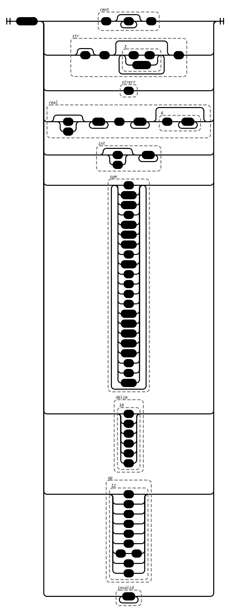

Regex Railroad
==============

This crate creates railroad diagrams from regular expressions, in order to run it
you need the following dependencies:

- cargo
- python
- python-virtualenv

## Examples

Simple regex:

```bash
$ build-rail '[^ ](a+k*|[abc])' examples/simple.svg
```


Non-trivial regex (Lisp tokenization):

```
(?P<cmnt>;.*$)|(?P<str>r?"(\\"|[^"])*")|(?P<strerr>")|(?P<real>[+-]?\d+\.\d+(e\d+)?)|(?P<int>[+-]?\d+)|(?P<sym>[:_/?!&~\*+=%<>\d\w-]+)|(?P<delim>(\(|\)|\[|\]|\{|\}))|(?P<op>([\^]|'|`|\||\$|\#|,@|,|¬))|(?P<invalid>\S+)
```



## How it works

I just wanted to generate some railroad-diagrams without having to use one of
the web-based platforms, so I took the path of least resistance. The Rust
program uses the `regex-syntax` crate to parse the regex, then it traverses the
AST while generating a Python program. This Python program will look something
like this:

```python
import sys
from railroad import *
Diagram("start", Choice(0, Group(Sequence(';', ZeroOrMore('.'), "$", ), 'cmnt'), Group(Sequence(Optional('r'), '"', ZeroOrMore(Group(Choice(0, Sequence('\\', '"', ), '[^"]', ), '3')), '"', ), 'str'), Group('"', 'strerr'), Group(Sequence(Optional(Choice(0, '+', '-', )), OneOrMore('\d'), '.', OneOrMore('\d'), Optional(Group(Sequence('e', OneOrMore('\d'), ), '6')), ), 'real'), Group(Sequence(Optional(Choice(0, '+', '-', )), OneOrMore('\d'), ), 'int'), Group(OneOrMore(Choice(0, '!', '%-&', '*-+', '-', '/-:', '<-?', 'A-Z', '_', 'a-z', '~', 'ª', 'µ', 'º', 'À-Ö', 'Ø-ö', 'ø-ˁ', 'ˆ-ˑ', 'ˠ-ˤ', 'ˬ', 'ˮ', "...")), 'sym'), Group(Group(Choice(0, '(', ')', '[', ']', '{', '}', ), '10'), 'delim'), Group(Group(Choice(0, Choice(0, '^', ), '\'', '`', '|', '$', '#', Sequence(',', '@', ), ',', '¬', ), '12'), 'op'), Group(OneOrMore('\S'), 'invalid'), )).writeSvg(sys.stdout.write)
```

Now that you know how it works, you know not to ever run it with untrusted
input.
